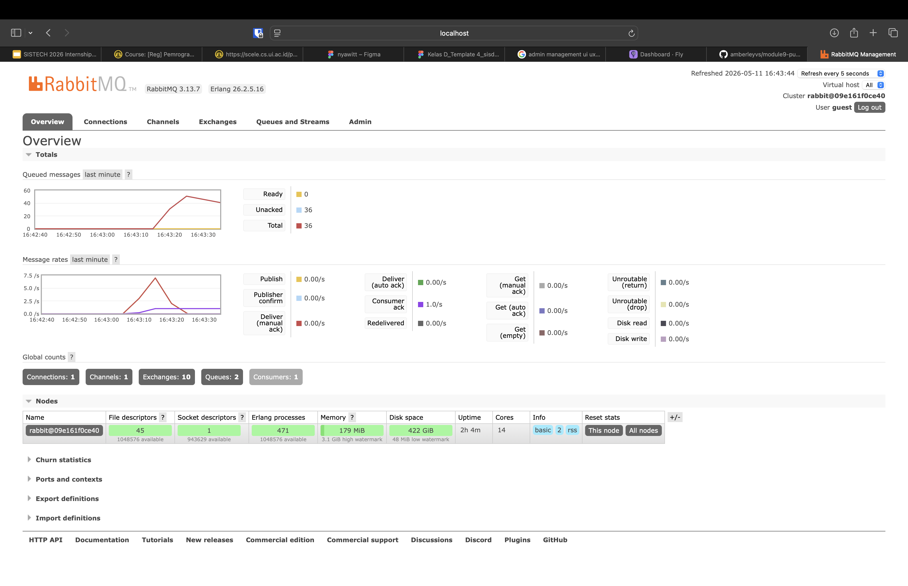
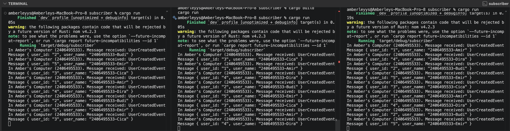

# Tutorial A: Event-Driven Architecture

**1. What is AMQP?**

AMQP stands for Advanced Message Queuing Protocol. It is a messaging protocol used by applications to communicate through a message broker. In this tutorial, AMQP is used so the publisher and subscriber can communicate through RabbitMQ without directly calling each other.

**2. What does it mean? guest:guest@localhost:5672 , what is the first guest, and what is the second guest, and what is localhost:5672 is for?**

The first guest is the username used to connect to RabbitMQ.

The second guest is the password used to connect to RabbitMQ.

localhost:5672 means the RabbitMQ server is running on the local computer, and the application connects to it through port 5672. Port 5672 is the default port used by RabbitMQ for AMQP communication.

### Simulation Slow Subscriber

In this experiment, I simulated a slow subscriber by adding a 1 second delay in the subscriber program.

I ran the publisher several times quickly. Each publisher run sends 5 messages to RabbitMQ. Because the subscriber processes messages slowly, the messages are not consumed immediately and they temporarily accumulate in the queue.

In my RabbitMQ dashboard, the total number of queued messages reached 36.

This happened because the publisher sent messages faster than the subscriber could process them. The subscriber only processes around 1 message per second because of the added delay, while the publisher can send multiple messages almost instantly. Therefore, RabbitMQ stored the remaining messages in the queue.

The number is 36 because some messages had already been consumed by the subscriber while I was checking the RabbitMQ dashboard. If I ran the publisher more times or checked the dashboard earlier, the total queue could be higher. If I waited longer, the total queue would decrease because the subscriber would continue processing the messages one by one.

This shows that RabbitMQ helps handle slow consumers by keeping unprocessed events in a queue until the subscriber is ready to process them.

###Reflection and Running at Least Three Subscribers

In this experiment, I ran three subscriber programs at the same time. All of them were connected to the same RabbitMQ message broker and listened to the same `user_created` queue.

After that, I ran the publisher several times quickly. Each publisher run sent 5 messages to RabbitMQ.

From the console output, the messages were processed by different subscriber terminals. This means the event processing was distributed across multiple subscribers instead of being handled by only one subscriber.

Compared to the previous slow subscriber experiment, the queue decreased faster. This happened because there were three subscribers processing messages at the same time. Even though each subscriber still had a 1 second delay, the total processing capacity became higher because the workload was shared.

The RabbitMQ chart also shows that the queue spike went back down to 0. This means the messages were successfully consumed by the subscribers.

This demonstrates one benefit of event-driven architecture. When the system has a slow consumer, we can add more subscribers to process messages from the same queue. This helps the system handle more events without forcing the publisher to wait for each message to be processed.

One thing that can be improved from the code is the use of `loop {}` in the subscriber. It keeps the subscriber running, but it is not the best approach because it may waste CPU resources. A better implementation should use a proper blocking mechanism or async runtime.

Another improvement is error handling. The code currently uses `unwrap()` when creating the RabbitMQ listener and publisher. If RabbitMQ is not running or the connection fails, the program will panic. It would be better to handle the error and show a clearer message.